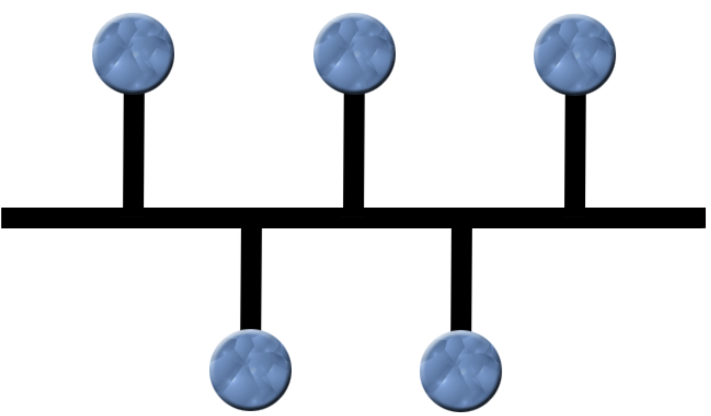
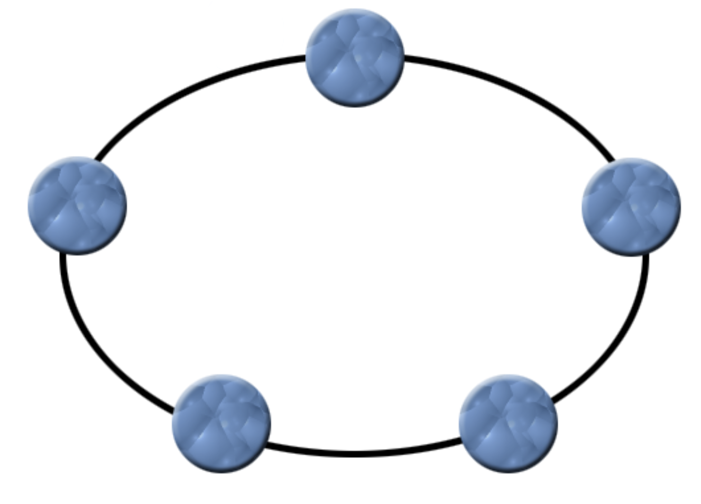
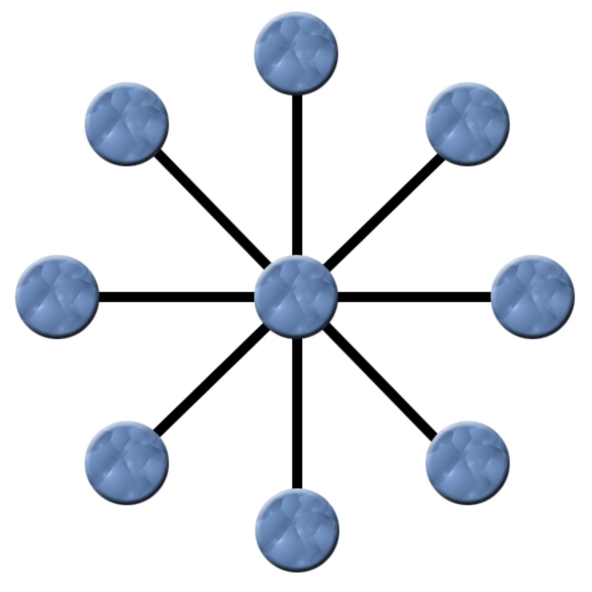
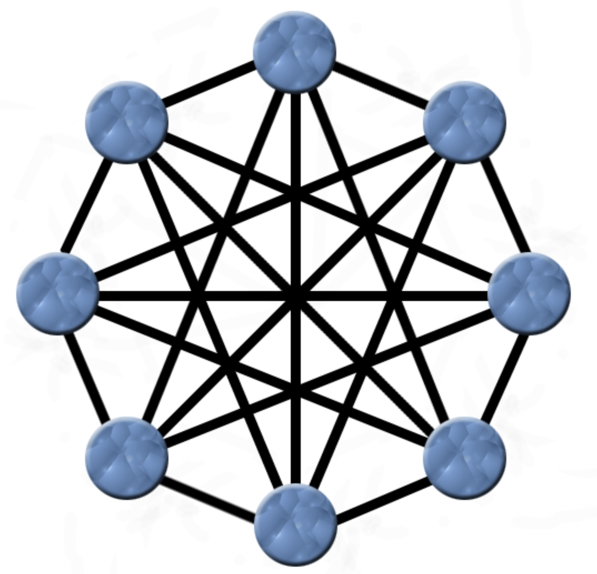

# [Embedded] 네트워크 기초 
 

## 네트워크란? 

기본적으로, 노드와 링크가 서로 연결되어 있으며 리소스를 공유하는 하나의 집합을 말한다. 

BFS나 DFS를 공부하며 접하던 그래프도 네트워크의 일종이라고 볼 수 있다. 

하지만 보통 네트워크에 있는 노드와 링크는

- 노드 : 서버, 라우터, 스위치 등
- 링크 : 유선통신, 무선통신

위 사항들을 말한다. 
 

## 처리량과 지연시간 

### 처리량 
 

처리량은 링크 내에서 성공적으로 전달된 데이터의 양을 말한다. 

보통 많은 트래픽을 처리한다는 말은 많은 데이터 처리량을 가진다는 의미이다. 

대역폭은 주어진 시간 동안 네트워크 연결을 통해 흐를 수 있는 최대 비트 수이며, 

처리량의 단위로는 bps(bits per second)를 쓴다. 

처리량은 사람들이 접속할 때마다 커지는 트래픽, 네트워크 장치 간의 대역폭, 네트워크 중간의 에러, 장치의 하드웨어 스펙에 영향을 받는다. 

### 지연시간 
 

요청이 처리되는 시간을 말하며, 어떤 메세지가 두 장치 사이를 왕복하는데 걸리는 시간을 말한다. 

지연 시간은 링크의 타입(유선, 무선), 패킷 크기, 라우터의 패킷 처리 시간에 영향을 받는다. 

 

## 네트워크 토폴로지 
 

네트워크 토폴로지란, 노드와 링크가 어떻게 배치되어 있는지에 대한 방식이자 연결 형태를 의미한다. 

종류로는 트리 토폴로지, 버스 토폴로지, 스타 토폴로지, 링형 토폴로지, 메시 토폴로지가 있다. 

[후술 내용 및 사진 출처](https://m.blog.naver.com/hilineisp/10169694570)

### 트리 토폴로지 

하나의 노드에 여러 개의 노드가 트리형으로 연결되어 있고, 

양방향으로 모든 노드에게 데이터를 전송하는 형태.

- 장점: 네트워크 확장이 쉽고, 관리도 편하며, 통신 회선수가 절약된다.
- 단점: 상위 회선에 문제가 생기면 하위 회선 모두 문제가 생기며, 트래픽 집중 문제도 발생한다.

 

### 버스 토폴로지 

단일 케이블에 네트워크 회선을 모두 연결하는 형태이다. 

- 장점 : 구축이 쉽고, 비용이 저렴하다. 또한, 하나의 컴퓨터에 문제가 생겨도 다른 컴퓨터에 영향을 주지 않는다.
- 단점 : 동시에 컴퓨터 간 통신이 불가능하며, 케이블에 문제가 생기면 전체에 영향이 간다. 또한, 문제 처리가 어렵고, 시간도 오래걸린다.

 

### 링형 토폴로지 

하나의 케이블로 서로 이웃하는 컴퓨터끼리 연결해서 고리구조를 형성하는 형태이다. 

- 장점 : 설치 비용이 저렴하고, 똑같은 접속기회를 제공하기 때문에 데이터 충돌이 발생하지 않는다. 그리고 토큰 패싱을 통해 패킷 충돌을 방지할 수 있다.
- 단점 : 통신의 효율성이 낮으며, 넓은 지역에 구축할 경우 비용이 많이 든다.

 

### 성형 토폴로지 

중앙 노드를 중심으로 모든 노드가 연결되는 형식이다. 

중앙의 노드에서 다른 노드들과 point-to-point형식으로 연결하며, 중앙노드가 나머지를 제어한다. 

- 장점 : 네트워크의 확장과 유지보수가 쉬우며, 장애를 발견하기가 쉬우며, 빠른 처리가 가능하다.
- 단점 : 사용자가 많아지면 트래픽이 많아져 속도가 저하되며, 중앙 노드가 문제가 생기면 시스템이 다운된다.

 

### 망형 토폴로지 

모든 노드가 서로서로 연결된 형태이다. 

- 장점 : 특정 통신 회선에 문제가 생겨도 다른 경로를 통해 전송이 가능하며, 가용성이 높고 효율이 높다.
- 단점 : 네트워크 설치, 관리, 구성이 어려우며, 비용이 많이 든다.

 

## 네트워크의 분류 
 

규모를 기반으로 네트워크를 분류할 수 있다.

- 사무실과 개인적으로 소유가 가능한 LAN, 근거리 통신망을 의미하며 같은 건물이나 캠퍼스 같은 공간에서 운영된다.
- 대도시 등 도시 규모의 MAN
- 세계 규모의 WAN

 

## 네트워크 병목현상과 성능 분석 명령어 
 

### 병목현상 

병목현상이란, 전체 시스템의 성능이나 용량이 하나의 구성요소로 인해 제한을 받는 현상이다. 트래픽이 많이 발생하고 그 트래픽을 잘 처리하거나 관리하지 못하면 마치 교통체증처럼 처리속도가 느려지거나 접속이 안되는 현상이 발생한다. 
쉽게 말해서, 10차선에서 3차선으로 급격히 차선이 줄어드는 상황에서 자동차들이 몰려서 발생하는 체증현상이라고 생각하면 될 것 같다.

병목현상의 주된 원인은 아래와 같다.

- 네트워크 대역폭
- 네트워크 토폴로지
- 서버 CPU, 메모리 사용량
- 비효율적 네트워크 구성

### 성능 분석 명령어 

병목현상을 해결하기 위해선 성능을 분석해야한다. 이를 수행하는 명령어를 알아보자. 

- ping : 대상 노드를 향해 패킷을 전송하여 패킷 수신 상태와 도달 시간등을 측정할 수 있다. 
입력형태는 ping [IP 또는 도메인 주소] 이다.
- netstat : 접속되어 있는 서비스들의 네트워크 상태를 표시하는데 사용되며, 네트워크 접속, 라우팅 테이블, 네트워크 프로토콜등 리스트를 보여준다.
- nslookup : 특정 도메인에 매핑된 IP를 확인하기 위해 사용한다.
- tracert(윈도우), traceroute(리눅스) : 목적지 까지의 네트워크 경로를 확인할 때 사용하며, 어느 구간에서 속도가 저하되는지 확인이 가능하다.

 

## 네트워크 프로토콜 

네트워크 프로토콜이란 다른 장치들끼리 데이터를 주고받기위한 공통 통신 규약이다. 
인터넷은 TCP/IP 기반하에 동작하는데 이 자체가 프로토콜이다. 
IEEE 라는 단체가 정한다. 

- IEEE 802.11 : 우리가 아는 Wi-Fi가 IEEE 802.11에 기반하고 있다.
- IEEE 802.3 : 유선 LAN 프로토콜로, 유선으로 LAN을 구축할 때 쓰이는 프로토콜.
- HTTP : 웹 서버를 구축하고 통신하기 위한 네트워크 프로토콜이다.
