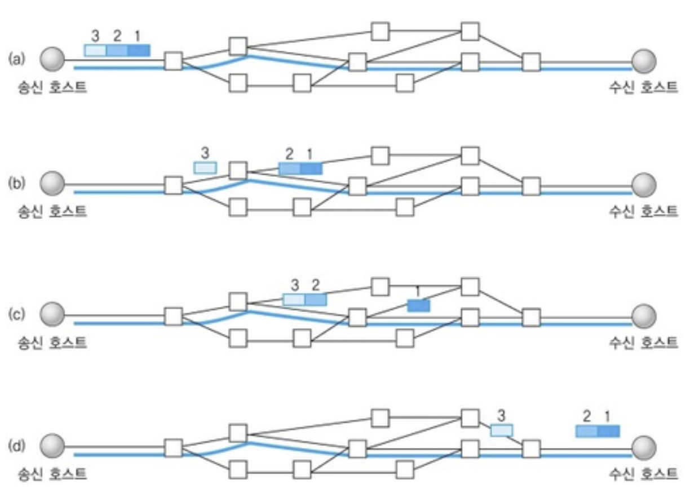
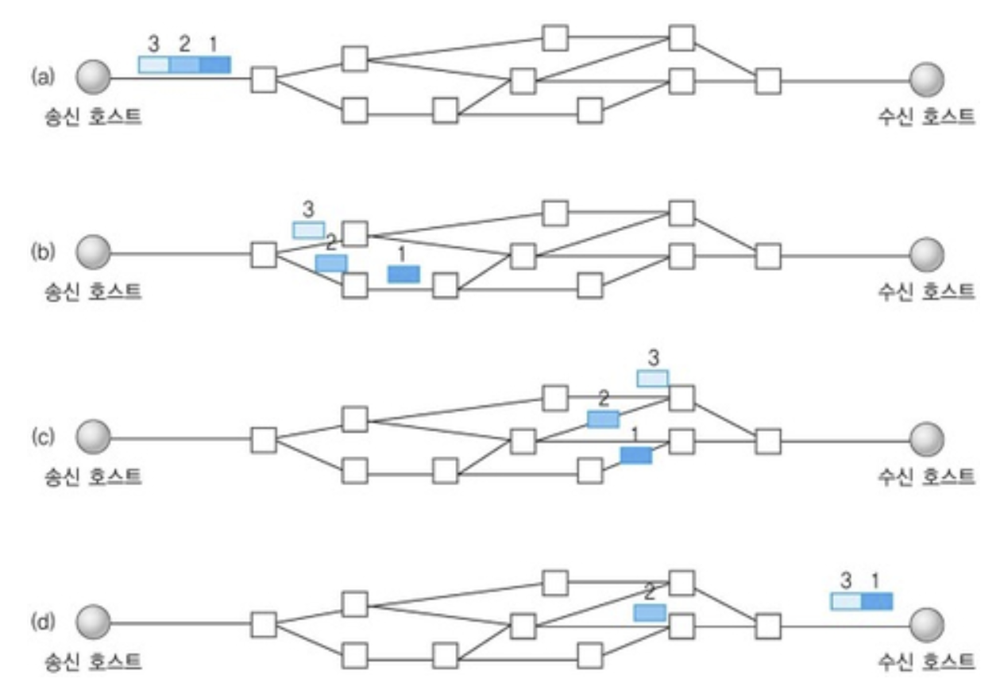
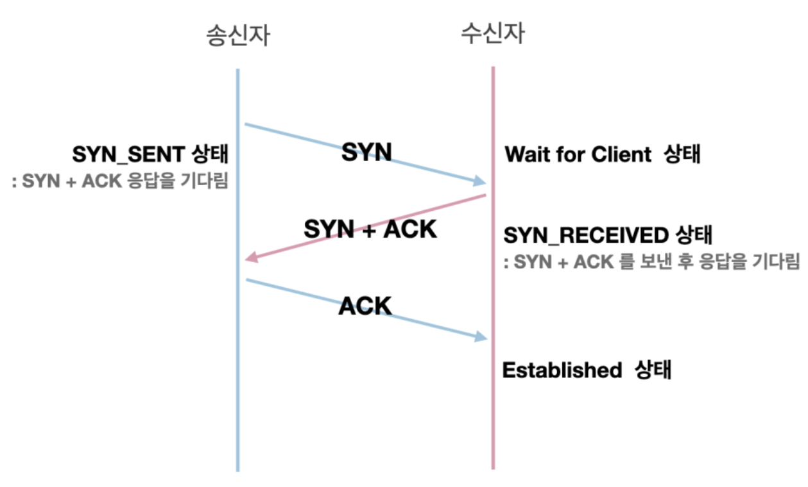
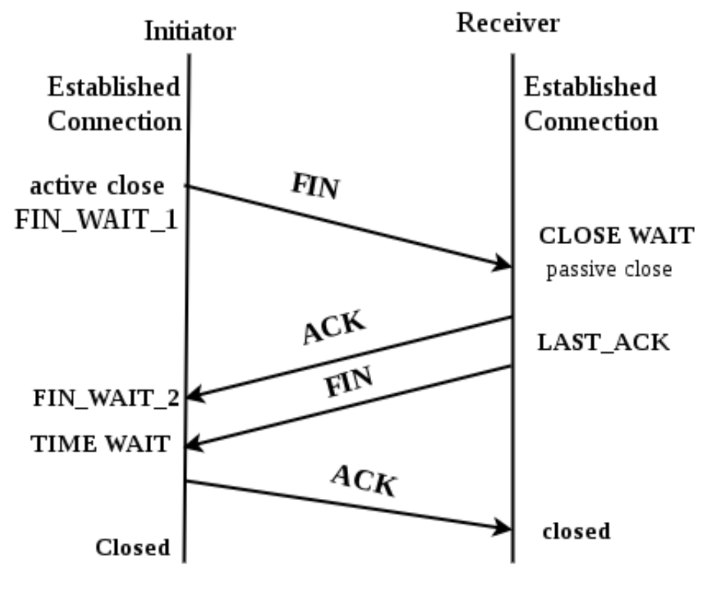

# [Embedded] TCP/IP 4계층 모델 
 

인터넷 프로토콜 스위트는 인터넷에서 컴퓨터들이 서로 정보를 주고 받는데 쓰이는 프로토콜의 집합이다. 

이는 TCP/IP 4계층이나 OSI 7계층으로 설명이 가능하다. 

## TCP/IP 4계층과 OSI 7계층 

- TCP/IP 4계층
    + 애플리케이션 계층
    + 전송 계층
    + 인터넷 계층
    + 링크 계층

 

- OSI 7계층
    + 애플리케이션 계층
    + 프레젠테이션 계층
    + 세션 계층
    + 전송 계층
    + 네트워크 계층
    + 데이터 링크 계층
    + 물리 계층

차이점이라면 TCP/IP 4계층의 애플리케이션 계층은 OSI 7계층에서는 애플리케이션 계층, 프레젠테이션 계층, 세션 계층의 3개 계층으로 쪼개어 표현하고, 
또한 TCP/IP 4계층의 인터넷 계층은 OSI 7계층에선 네트워크 계층으로 표현되며, 
TCP/IP 4계층의 링크 계층은 OSI 7계층에선 데이터링크 계층, 물리 계층으로 쪼개진다. 

이 계층들은 특정 계층이 변경되었을 때, 다른 계층이 영향을 받지 않도록 설계되었다. 
예를 들어, 전송 계층에서 TCP를 UDP로 변경한다고 해서 인터넷 웹 브라우저를 다시 설치해야 하는 것은 아니다. 

 

## TCP/IP 4계층의 대표적인 스택 

- 애플리케이션 계층 : FTP/HTTP/SSH/SMTP/DNS
- 전송 계층 : TCP/UDP/QUIC
- 인터넷 계층 : IP/ARP/ICMP
- 링크 계층 : 이더넷

 

## 애플리케이션 계층 

애플리케이션 계층은 FTP, HTTP, SSH, SMTP, DNS 등 응용 프로그램이 사용되는 프로토콜 계층이며 서비스를 실질적으로 사람들에게 제공하는 층이다. 

 

## 전송 계층 

전송 계층은 송신자와 수신자를 연결하는 통신 서비스를 제공하며 연결 지향 데이터 스트림 지원, 신뢰성, 흐름 제어를 같이 제공하면서 애플리케이션 계층과 인터넷 계층 사이의 중계 역할을 한다. 

대표적으로 TCP, UDP가 있다.

- TCP
    + 패킷 사이의 순서를 보장한다.
    + 연결지향 프로토콜을 사용해서 신뢰성이 높다.
    + 가상회선 패킷 교환 방식을 사용한다.

- UDP
    + 순서를 보장하지 않는다.
    + 수신 여부를 확인하지 않아 신뢰성이 낮다.
    + 데이터그램 패킷 교환 방식을 사용한다.

 

### 가상회선 패킷 교환 방식

지국 사이의 경로가 패킷 전송이 이루어지기 전에 확정되어야 하고, 논리적 접속 혹은 가상 회선상으로 데이터가 교환된다. 그리고 각 패킷에서는 가상회선 식별자가 포함되며 모든 패킷을 전송하면 가상회선이 해제되고 패킷들은 전송한 순서대로 도착한다.

 

### 데이터그램 패킷 교환 방식

데이터그램 패킷 교환 방식은 패킷이 독립적으로 이동하여 최적 경로를 선택해 간다. 
그래서 서로 다른 경로로 전송되기 때문에 순서가 바뀔 수 있어서 특수한 목적의 경우에만 사용된다. 

 

### TCP 연결의 성립과정 (3-Way-HandShake) 

- 클라이언트가 서버에게 SYN 패킷을 보냄.Client > Server : TCP SYN
- 서버가 SYN(x)을 받고 클라이언트로 받았다는 신호 ACK(x + 1)와 SYN(y)패킷을 보냄.Server > Client : TCP SYN, ACK
- 클라이언트는 서버의 응답(ACK(x+1), SYN(y))을 받고, ACK(y+1)를 서버로 보냄.Client > Server : TCP ACK
- SYN : 'Synchronize sequence numbers', 연결 요청. 세션을 설정하는데 사용되며 초기에 시퀀스 번호를 보냄.
- ACK : 'Acknowledgement', 보낸 시퀀스 번호에 TCP 계층에서의 길이 또는 양을 더한 것과 같은 값을 ACK에 포함하여 전송.

 

### TCP 연결의 해제과정 (4-Way-HandShake) 

- 클라이언트는 서버에게 연결을 종료한다는 FIN 플래그 보냄.
- 서버는 FIN을 받고, 확인했다는 ACK를 클라이언트에게 보낸다. 이 때, 모든 데이터를 보내기 위해 CLOSE_WAIT 상태가 된다.
- 데이터를 모두 보냈다면, 연결이 종료되었다는 FIN 플래그를 클라이언트에게 보낸다.
클라이언트는 FIN을 받고, 확인했다는 ACK를 서버에게 보낸다. 이 때 아직 서버로부터 받지 못한 데이터가 있을 수 있으므로 TIME_WAIT을 통해 기다린다.
- 서버는 ACK를 받고, 소켓을 닫는다(Closed)
- TIME_WAIT 시간이 끝나면 클라이언트도 닫는다 (Closed) => 의도치 않은 에러로 연결이 데드락으로 빠지는 것을 방지한다.

여기서 TIME_WAIT란, 소켓이 바로 소멸되지 않고 일정 시간 유지되는 상태를 말하며, 지연 패킷들의 문제를 해결하는데 쓰인다. 
우분투 같은 리눅스 계열은 60초, 윈도우는 4분이다. 즉, OS마다 조금씩 다르다. 

 

## 인터넷 계층 
 

인터넷 계층은 장치로부터 받은 네트워크 패킷을 IP주소로 지정된 목적직로 전송하기 위해 사용되는 계층이다. IP, ARP, ICMP등이 있으며 패킷을 수신해야 할 상대의 주소를 지정해 데이터를 전달한다. 
상대방이 수신을 했는지에 대해 보장을 하지 않는다. 

 

## 링크 계층 
 

링크 계층은 전선, 광섬유, 무선 등으로 실질적으로 데이터를 전다랗며 장치 간에 신호를 주고받는 '규칙'을 정하는 계층이다. 
OSI 7계층에서는 물리계층과 데이터 링크 계층으로 나누기도 하는데 물리 계층은 무선 LAN과 유선 LAN을 통해 0과 1로 이뤙진 데이터를 보내는 계층이며 
데이터 링크 계층은 '이더넷 프레임'을 통해 에러 확인, 흐름 제어, 접근 제어를 담당하는 계층을 말한다. 

 

### 전이중화 통신 

전이중화 통신은 양쪽 장치가 동시에 송수신할 수 있는 방식을 말한다. 이는 송신로와 수신로를 나눠서 데이터를 주고 받으며 현대의 고속 이더넷은 이 방식을 기반으로 한다. 

 

### 반이중화 통신 

양쪽 장치는 서로 통신할 수 있지만, 동시에는 통신할 수 없으며 한 번에 한 방향만 통신할 수 있는 방식을 말한다. 
일반적으로 장치가 신호를 수신하기 시작하면 응답하기 전에 전송이 완료될 때까지 기다려야 한다. 
또한, 둘 이상의 장치가 동시에 전송하면 충돌이 발생하여 메세지가 손실될 수 있으므로 충돌 방지 시스템이 필요하다. 